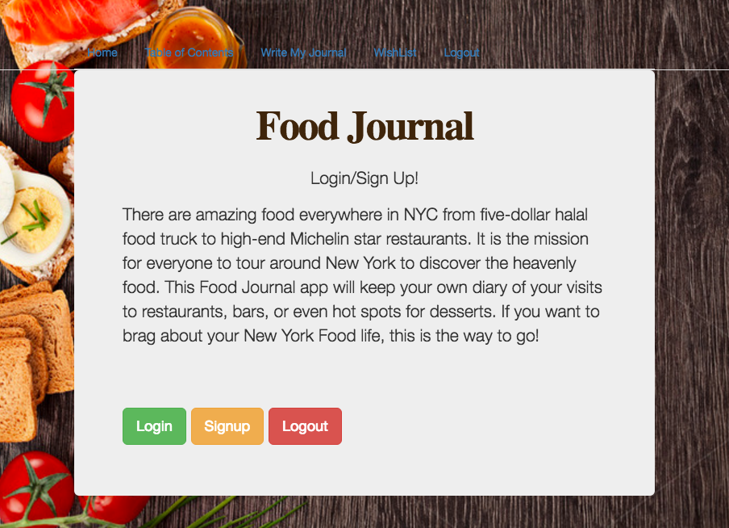
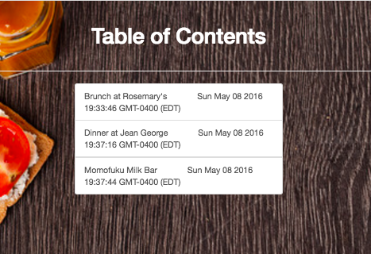
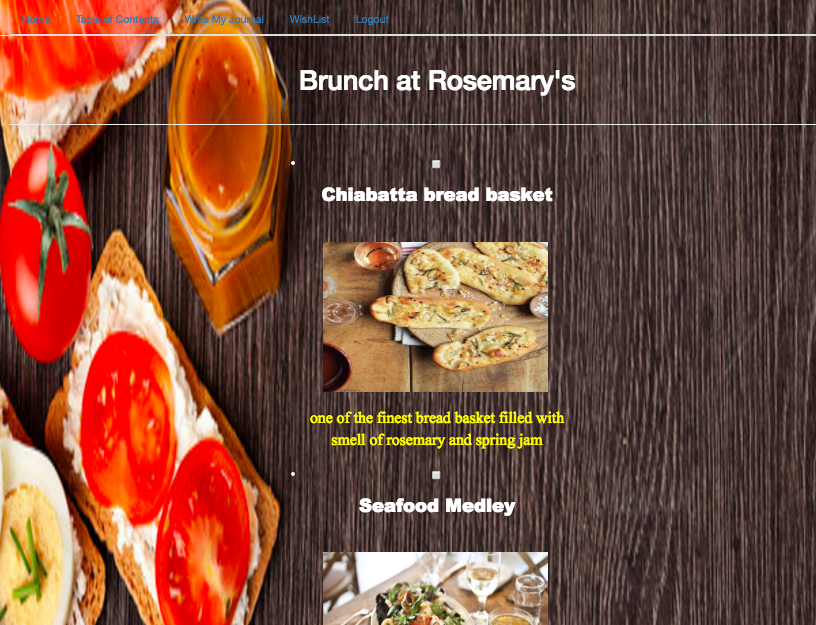
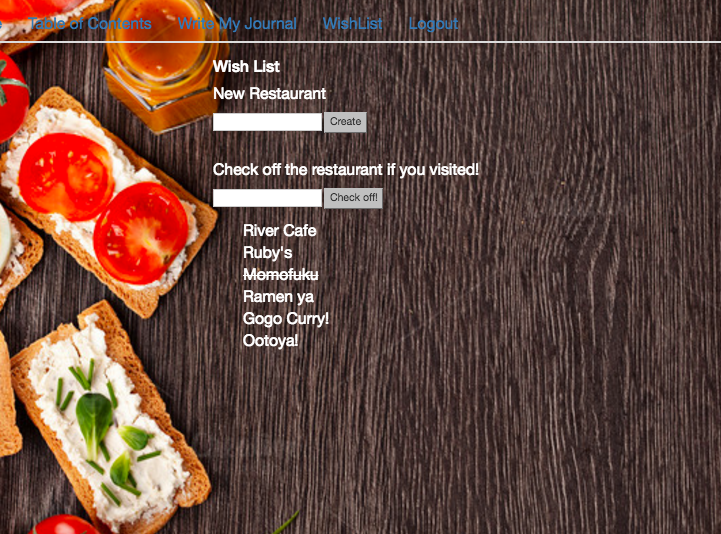

#Food Journal

##Overview

There are amazing food everywhere in NYC from five-dollar halal food truck to high-end Michelin star restaurants. It is the mission for everyone to tour around New York to discover the heavenly food. This Food Journal app will keep your own diary  of your visits to restaurants, bars, or even hot spots for desserts. If you want to brag about your New York Food life, this is the way to go!

User can register or log in, and also sign out. Once they're logged in, they can make the multiple lists of places(restaurants or travelling city), and the user can add the lists of food in that lists. User can add or modify the lists easily. Also, user can add the notes of wishlist that he/she wishes to go or eat in the future.


##Data Model
First draft schema:

```javascript
var mongoose = require('mongoose');
var URLSlugs = require('mongoose-url-slugs');
var bcrypt   = require('bcrypt-nodejs');

var WishList = mongoose.Schema({
    name:{type: String, required:true},
    checked: Boolean
});

var Food = mongoose.Schema({
    name: {type: String, required:true},
    comment:{type: String, required:true},
    checked: Boolean,
    imagebase64: String,
    imagetype: String
});


var Place = mongoose.Schema({
    title: {type: String, required:true},
    uploaded:{type:Date, default: Date.now},
    items: {type: [Food], unique: false, sparse: true}
});

var User = mongoose.Schema({
    first_name: String,
    middle_name: String,
    last_name: String,
    email: String,
    password: String,
    lists: {type: [Place], unique: false, sparse: true},
    wish:[WishList]
});

```
##User Story
.1. Go to http://i6.cims.nyu.edu:12418/
2. Login with email: “admin@nyu.edu” pw: “admin” ( or you can signup)
3. After you are on Profile Page, Click on “Write A Journal”
4. You should see the lists of Food Journal
5. Enter the title of Journal to create the new list and submit
6. You should see your new list added on the Journal list
7. Click the new added list to add or delete by click on checkbox of Food list
8. Click Wishlist on the navigation tab
9. You should see the list of restaurants that I want to go in the future
10. Add a new restaurant or Check off if you already visited!

## Wireframes







## Reserach Topics
* (3)**Passport-Local**: Integrate user authentication
* (2)**Parsley**: Perform client side form validation using a JavaScript library
* (1)Using CSS framework throughout the website


# Food-Journal
